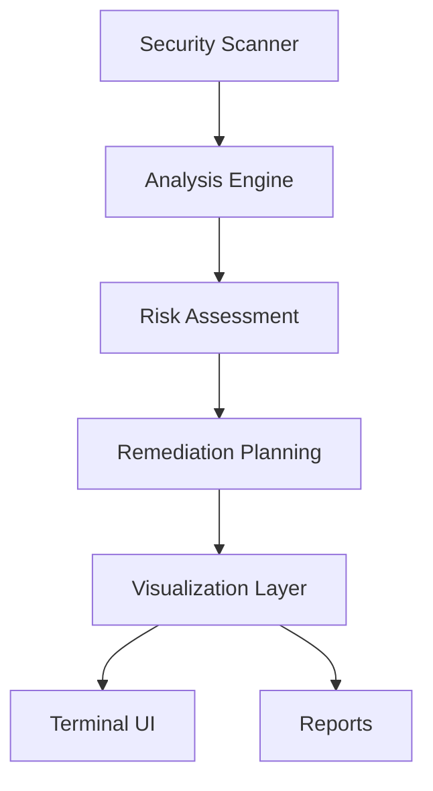

# **CloudGuardStack 🛡️**

[](https://www.python.org/downloads/)
[](LICENSE)
[](CONTRIBUTING.md)

> A real-time cloud security command center with live terminal visualization, IAM risk detection, storage vulnerability auditing, and automated remediation across multi-cloud environments.

## 🌟 **Core Capabilities**

### **Real-Time Cloud Security**

* Continuous IAM privilege scanning
* Storage misconfiguration + access exposure checks
* Unified AWS / Azure / GCP support
* Live terminal-grade visual risk feedback

### **Automated Remediation**

* Generates actionable fix plans instantly
* Recommends least-privilege roles and policies
* Enforces hardened storage configurations
* Compliance-aware correction logic

### **Visual Security Intelligence**

* Interactive risk dashboards
* ASCII-based graphs + trends in your terminal
* Markdown + share-ready security reports

### **Built for Teams**

* CI/CD-ready security enforcement
* Custom policy templating
* Terraform-based IaC integration
* Full testing + validation suite included

## 🚀 **Quick Demo**

```powershell
# Clone the repository
git clone https://github.com/MasterCaleb254/CloudGuardStack.git
cd CloudGuardStack

# Install dependencies
pip install -r requirements.txt

# Run the demo
.\integrated-demo.ps1
```

## 📊 **Security Engines Inside**

**1. IAM Security Scanner**

* Evaluates identity usage + permissions behavior
* Flags excessive or dangerous access paths
* Permission graph mapping + risk scoring

**2. Storage Configuration Auditor**

* Detects publicly exposed buckets/containers
* Checks encryption + object security posture
* Identifies sensitive data footprints

**3. Remediation Engine**

* Auto-generates fix steps + recommended patches
* Prioritizes issues by impact
* Includes rollback logic for safe remediation

**4. Visualization Layer**

* Real-time terminal insights
* Risk trends + severity heatmaps
* Categorized findings + impact summaries

## 🔧 **System Architecture**



## 🛠️ **Tech Stack**

| Component     | Tech                               |
| ------------- | ---------------------------------- |
| Core Runtime  | Python 3.8+                        |
| Visualization | Matplotlib, Plotext                |
| Cloud APIs    | Boto3, Azure SDK, Google Cloud SDK |
| IaC           | Terraform                          |
| Testing       | Pytest                             |
| CI/CD         | GitHub Actions                     |
| Policy Engine | OPA, Cloud Custodian               |

## 📈 **Where CloudGuardStack Fits**

### **Security Monitoring**

* Organization-wide posture visibility
* Risk insights mapped to real users + resources

### **DevSecOps Pipelines**

* Security gates that don’t slow down delivery
* Automated issue resolution directly in CI/CD

### **Compliance & Governance**

* Control validation + audit artifacts
* Enforcement of internal + external standards

### **Incident Response**

* Real-time detection signals
* Containment + recovery assistance

## 📚 **Documentation & Resources**

* Getting Started → `docs/GETTING_STARTED.md`
* Architecture Overview → `docs/architecture/component-diagram.md`
* Contributing → `CONTRIBUTING.md`
* Runbooks:

  * IAM Cleanup → `docs/runbooks/iam-cleanup.md`
  * Incident Response → `docs/runbooks/incident-response.md`
  * Storage Remediation → `docs/runbooks/storage-remediation.md`

## 🔒 **Security Controls Built-In**

* Least-privilege IAM hardening
* Storage access + encryption integrity checks
* Sensitive data detection
* Automated remediation pipelines
* Audit logging and traceability

## 🤝 **Contributing**

Pull requests, ideas, and improvements are always welcome.
See the **Contributing Guidelines** before submitting changes.

## 📄 **License**

MIT License. Check the `LICENSE` file.

---

### 🏷️ Tags

`cloud-security` • `security-tools` • `iam-security` • `devsecops` • `security-automation` • `python` • `terminal-graphics` • `multi-cloud`

---

Made with ❤️ for engineers who secure clouds, not just run them.
