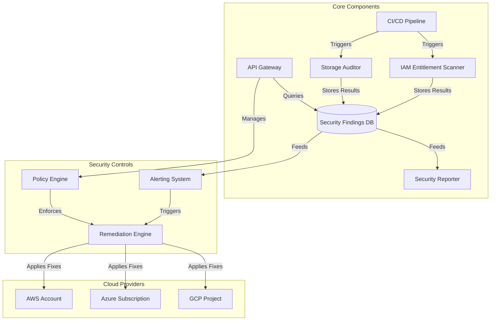

# CloudGuardStack Component Architecture

## Key Components

### 1. CI/CD Pipeline
- **Purpose**: Orchestrates security scans and deployments
- **Technologies**: GitHub Actions, Terraform Cloud
- **Inputs**: Infrastructure code, policy definitions
- **Outputs**: Deployment status, scan results

### 2. IAM Entitlement Scanner
- **Purpose**: Identifies excessive IAM permissions
- **Coverage**: AWS IAM, Azure RBAC, GCP IAM
- **Output**: Entitlement reports, risk scores

### 3. Storage Auditor
- **Purpose**: Detects public and insecure storage
- **Coverage**: S3, Azure Blob, Google Cloud Storage
- **Output**: Security findings, compliance status

### 4. Security Reporter
- **Purpose**: Generates compliance reports
- **Features**: Executive dashboards, detailed findings
- **Integrations**: SIEM, Ticketing systems

### 5. Policy Engine
- **Purpose**: Enforces security policies
- **Features**: Policy as Code, custom rules
- **Integration**: Open Policy Agent (OPA)

### 6. Remediation Engine
- **Purpose**: Automates issue resolution
- **Actions**: Auto-fix, notification, ticketing
- **Workflows**: Customizable playbooks

## Data Flow

1. **Scan Initiation**
   - CI/CD triggers scanners based on events
   - Scanners authenticate with cloud providers

2. **Data Collection**
   - IAM policies and storage configurations collected
   - Resource metadata and configurations extracted

3. **Analysis**
   - Policies evaluated against security baselines
   - Risk scores calculated for findings

4. **Reporting**
   - Results stored in security findings database
   - Alerts generated for critical issues
   - Reports generated for stakeholders

5. **Remediation**
   - Automated fixes applied based on policies
   - Manual review tickets created when needed
   - Verification scans confirm resolution