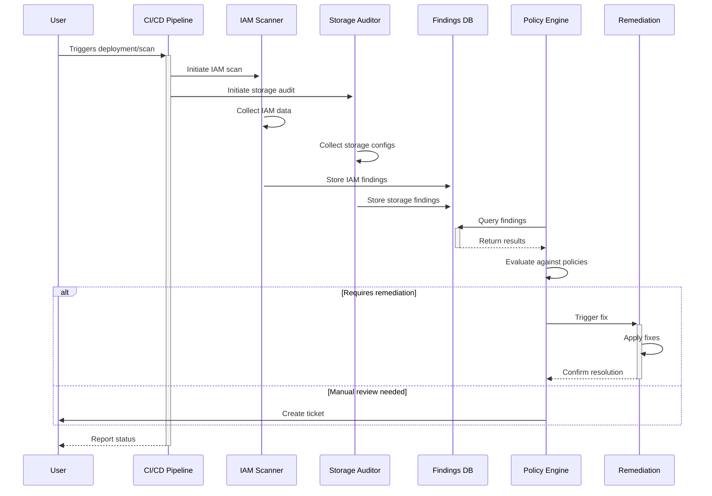
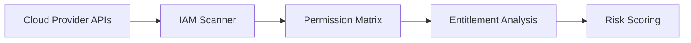

# CloudGuardStack Data Flow

## Overview
This document outlines the data flow within CloudGuardStack, detailing how information moves between components and security controls are enforced.


## Data Flow Details

### 1. Scan Initialization
- **Trigger**: Code push, schedule, or manual trigger
- **Authentication**: Cloud provider credentials via secure secrets
- **Scope Definition**: Target accounts, regions, resource types

### 2. Data Collection

#### IAM Data Collection

#### Storage Data Collection
```mermaid
flowchart LR
    A[Cloud Storage APIs] --> B[Storage Auditor]
    B --> C[Access Analysis]
    C --> D[Public Expose Check]
    D --> E[Compliance Check]